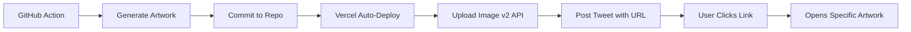

# ✅ Final Setup Checklist

## What's Already Done ✅

- [x] V2 media upload working
- [x] Hash-based navigation implemented
- [x] Vercel URL configured in `package.json`
- [x] Vercel URL configured in `.env`
- [x] Vercel URL configured in `env.example`

## ⚠️ One More Step Required

### Update GitHub Secrets for Automation

Your GitHub Actions workflow needs the `PORTFOLIO_URL` to generate correct tweet links.

**How to update:**

1. **Go to your GitHub repository:**
   ```
   https://github.com/YOUR_USERNAME/literate-octo-enigma/settings/secrets/actions
   ```

2. **Look for `PORTFOLIO_URL` secret:**
   - If it exists: Click "Update"
   - If not: Click "New repository secret"

3. **Set the value:**
   ```
   Name: PORTFOLIO_URL
   Value: https://literate-octo-enigma-ruby.vercel.app
   ```

4. **Save it!**

## Test Everything Works

### Test 1: Hash Navigation

Open these URLs in your browser:

```
https://literate-octo-enigma-ruby.vercel.app
https://literate-octo-enigma-ruby.vercel.app#019
https://literate-octo-enigma-ruby.vercel.app#006
```

**Expected result:**
- First URL: Shows artwork grid
- Second URL: Opens Signal 019 directly
- Third URL: Opens Signal 006 directly

### Test 2: Generate Test Artwork

```bash
npm run test:artwork
```

**Expected tweet:**
```
Signal 020: [AI-Generated Title]

https://literate-octo-enigma-ruby.vercel.app#020
```

**Then:**
1. Click the link in the tweet
2. Should open your Vercel site
3. Should show artwork #020 directly

## Your Complete Workflow Now



## Example Tweet

**What users will see:**
```
Signal 020: Ethereal Dance of Light

https://literate-octo-enigma-ruby.vercel.app#020
```

**What happens when they click:**
1. Browser opens: `https://literate-octo-enigma-ruby.vercel.app#020`
2. Your React app reads the hash: `020`
3. App finds artwork 020 in `artworks.json`
4. Artwork opens in fullscreen viewer
5. Perfect user experience! 🎨

## All Set! 🚀

Once you update the GitHub Secret, everything will work automatically:

- ✅ Daily artworks generate at 7:05 AM UTC
- ✅ Images upload via v2 API
- ✅ Tweets include your Vercel URL
- ✅ Links deep-link to specific artworks
- ✅ Vercel auto-deploys on every commit

## Quick Reference

| What | Value |
|------|-------|
| **Website** | https://literate-octo-enigma-ruby.vercel.app |
| **Tweet format** | `Signal XXX: Title\n\n[URL]#XXX` |
| **Test command** | `npm run test:artwork` |
| **Media test** | `npm run test:media-upload` |

---

**Need help?** Check:
- `V2_MEDIA_UPLOAD_FIXED.md` - Media upload details
- `HASH_NAVIGATION_SUMMARY.md` - Navigation details
- `VERCEL_SETUP_COMPLETE.md` - Vercel configuration

